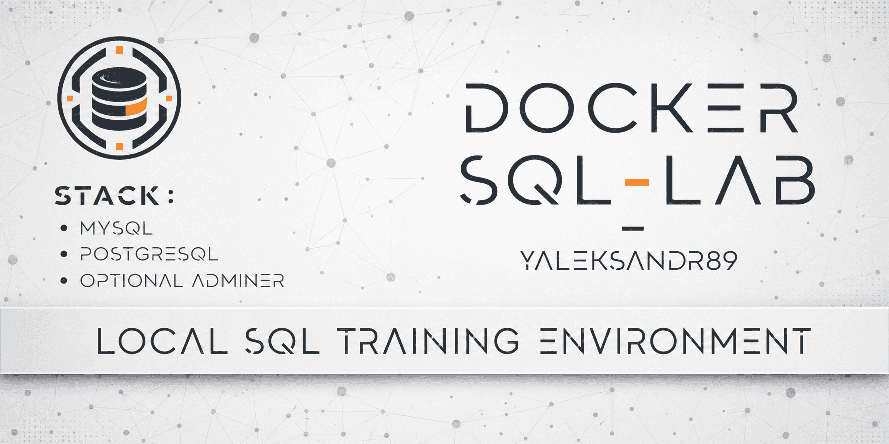

<p align="center">
  
</p>

# Docker SQL Lab

## Sprache auswählen

| Русский | English | Español | 中文 | Français | Deutsch |
| --- | --- | --- | --- | --- | --- |
| [Русский](../../README.md) | [English](README_en.md) | [Español](README_es.md) | [中文](README_zh.md) | [Français](README_fr.md) | **Ausgewählt** |

Eine lokale Docker-Compose-Umgebung zum Üben von SQL sowie zum Kennenlernen
und Vergleichen von MySQL und PostgreSQL. Beide DBMS lassen sich einzeln oder
gemeinsam starten. Die kompakte `demo`-Datenbank entsteht automatisch;
optionale Sakila-, Pagila- und Chinook-Datensätze liefern sofort abfragbare
Übungsdaten. Adminer wird nur bei Bedarf aktiviert.

## Bildschirmaufzeichnungen

Die Aufzeichnungen verwenden PhpStorm; DataGrip, DBeaver, Adminer oder ein
anderer MySQL-/PostgreSQL-Client eignen sich ebenfalls. Sie wurden auf Russisch aufgenommen.

| Szenario | Yandex Disk | Google Drive | Gezeigt wird |
|---|---|---|---|
| Erster Start mit obligatorischem `demo`, danach Übungsdatenbanken hinzufügen | [Ansehen](https://disk.yandex.ru/i/Kj4TcMSBuIDVeA "docker-sql-lab-demo-then-training-databases.mp4") | [Ansehen](https://drive.google.com/file/d/1HzYWbMuBEobXlbGQYNfHYVAq95TLqEPf/view?usp=sharing "docker-sql-lab-demo-then-training-databases.mp4") | Startet MySQL und PostgreSQL mit obligatorischem `demo`; prüft; bereitet Sakila, Pagila und Chinook vor; bestätigt die Neuinitialisierung; prüft erneut und führt SQL-Abfragen aus. |
| Erster Start mit vorab vorbereiteten Übungsdatenbanken | [Ansehen](https://disk.yandex.ru/i/nFgJZto8agbdWw "docker-sql-lab-training-databases-first-start.mp4") | [Ansehen](https://drive.google.com/file/d/1nKiGrJ4QINLCQcRk-k6vfTakpWsw-JS7/view?usp=sharing "docker-sql-lab-training-databases-first-start.mp4") | Bereitet Sakila, Pagila und Chinook vor dem ersten Start vor; initialisiert obligatorisches `demo` und Übungsdatenbanken zusammen; prüft Zugriff und führt SQL-Abfragen aus. |

## Stack und festgelegte Versionen

- MySQL 9.7.1 LTS
- PostgreSQL 18.4
- Adminer 5.4.2 Docker Official Image
- Docker Compose v2
- GNU Make und Bash für Projektbefehle und Initialisierungsskripte

Die festgelegten Standardwerte stehen in
[`.docker.env.example`](../../.docker.env.example); `make init` erstellt daraus
die lokale `.docker.env`. Die Services stehen in
[`docker-compose.yml`](../../docker-compose.yml).

<details>
<summary>⚠️ Wichtig: Dies ist eine Lernumgebung</summary>

Das Projekt ist kein produktionsfertiges Template. Für externe Nutzung sind
eigene Entscheidungen zu Zugangsdaten, Netzwerkfreigabe, Storage, Backups und
Betrieb nötig.

</details>

## Hauptfunktionen

- MySQL und PostgreSQL laufen einzeln oder gemeinsam.
- Jedes DBMS hat eine obligatorische `demo` mit denselben Seed-Datensätzen.
- Optional: Sakila und Chinook für MySQL, Pagila und Chinook für PostgreSQL.
- Adminer ist eine unabhängige optionale Oberfläche für beide DBMS.
- Daten-, Init- und Sample-Verzeichnisse sind je DBMS getrennt eingebunden.
- Prüfungen, vertrauenswürdige SQL-Imports und destructive Aktionen bündelt das
  [`Makefile`](../../Makefile).

## Voraussetzungen

1. Docker Engine oder Docker Desktop mit Docker Compose v2.
2. GNU Make, Bash und die von den Skripten verwendeten Unix-CLI-Basiswerkzeuge.

Empfohlen: Linux; macOS mit Docker Desktop; Windows mit Docker Desktop und
WSL2. Befehle werden im Repository-Stamm ausgeführt. Der Standardbranch ist
`master`.

## Schnellstart

```bash
make init
make up
```

`make init` erzeugt die lokale `.docker.env` aus
[`.docker.env.example`](../../.docker.env.example), prüft verwaltete Pfade und
legt Arbeitsverzeichnisse an. Beim ersten Containerstart initialisieren die
offiziellen Entrypoints beide DBMS. Auch ohne optionale Samples erhalten Sie
MySQL und PostgreSQL mit `demo` und Seed-Datensätzen.

`make up` startet MySQL, PostgreSQL und Adminer; `make up-no-ui` startet beide
DBMS ohne Adminer. Standardmäßig ist Adminer unter
`http://127.0.0.1:8081` erreichbar.

Startmodi, Verbindungen und Zugangsdaten:
[Erste Schritte](de/getting-started.md).

### Fertige Übungsdaten gewünscht?

Samples sind optional: `demo` wird immer erstellt; Sakila und Chinook sind für MySQL verfügbar, Pagila und Chinook für PostgreSQL.

**Erster Start mit leeren Datenverzeichnissen**

```bash
make init
make samples-mysql
make samples-postgres
make up
```

Bereiten Sie Samples vor der ersten Initialisierung vor; die Entrypoints laden sie zusammen mit `demo`.

> **Warnung:** Die Neuinitialisierung löscht die Daten des gewählten DBMS.
> Sichern Sie nur eigene Daten, die erhalten bleiben sollen; ein einmaliges Lab ohne wertvolle Änderungen braucht kein Backup.

<details>
<summary>📦 Das Lab lief bereits: Samples hinzufügen oder erneut verwenden</summary>

**Ohne Samples initialisiert.** `make up` wendet neue Init-/Sample-Dateien nicht an. Wenn wichtige Daten erhalten bleiben sollen, sichern Sie sie und wählen dann die passende Variante:

- MySQL: `make samples-mysql`, danach `make reinit-mysql CONFIRM=1`.
- PostgreSQL: `make samples-postgres`, danach `make reinit-postgres CONFIRM=1`.
- Beide DBMS: `make samples-mysql`, `make samples-postgres`, danach `make reinit-all CONFIRM=1`.

> **Warnung:** `reinit-*` löscht die gewählten Daten und läuft nur mit dem exakten `CONFIRM=1`.

**Samples bereits installiert.** Nutzen Sie `make up` oder das gewünschte `make up-*`: Erneuter download und reinit entfallen; die Datenbanken bleiben im bind-mounted storage erhalten.

</details>

Details: [Datenbanken und Samples](de/databases.md).

## Startmodi

| Befehl | MySQL | PostgreSQL | Adminer |
|---|---|---|---|
| `make up` | Startet | Startet | Startet |
| `make up-no-ui` | Startet | Startet | Stoppt |
| `make up-mysql` | Startet | Startet nicht | Startet nicht |
| `make up-postgres` | Startet nicht | Startet | Startet nicht |

Ein Einzel-DBMS-Befehl stoppt das andere nicht; Adminer wird separat verwaltet.
Alle Targets stehen im [`Makefile`](../../Makefile).

## Verbindungen und verfügbare Datenbanken

Im Compose-Netz nutzt Adminer `mysql` und `postgres`. Host-Clients nutzen
`127.0.0.1` und `MYSQL_PORT` oder `POSTGRES_PORT`. Für Übungen dienen
`DB_USER` und `DB_PASSWORD`.

| DBMS | Immer verfügbar | Nach optionaler Sample-Initialisierung |
|---|---|---|
| MySQL | `demo` | `sakila`, `chinook` |
| PostgreSQL | `demo` | `pagila`, `chinook` |

Optionale Datenbanken existieren erst nach der tatsächlichen Initialisierung.
Details: [Start und Verbindungen](de/getting-started.md) ·
[Datenbanken und Samples](de/databases.md).

## Zugangsdaten im Überblick

| Zweck | Benutzer | Passwort |
|---|---|---|
| Gemeinsamer Lernbenutzer | `DB_USER` | `DB_PASSWORD` |
| MySQL-Administrator | `root` | `MYSQL_ROOT_PASSWORD` |
| PostgreSQL-Superuser | `POSTGRES_SUPERUSER` | `POSTGRES_SUPERUSER_PASSWORD` |

`POSTGRES_SUPERUSER` und `DB_USER` müssen verschieden sein. Verwenden Sie für
Übungen den Lernbenutzer und ersetzen Sie Beispielpasswörter vor Freigaben.

## Datenbanken und wichtige Prüfungen

Beide `demo`-Datenbanken enthalten eine äquivalente Tabelle `demo_users` mit
fünf Zeilen. Diese Prüfungen brauchen keine laufenden DBMS:

```bash
make check-env
make config
make test-storage-paths
```

Nach dem Start prüft `make check` die `demo` und den Zugriff von `DB_USER`;
`make test-sql-imports` testet die öffentlichen Trusted-Import-Targets.
Reihenfolge und Grenzen:
[Prüfungen und Betrieb](de/operations.md).

## Sicherheit und Lebenszyklus

- `BIND_ADDRESS=127.0.0.1` veröffentlicht nur auf Loopback.
- `BIND_ADDRESS=0.0.0.0` öffnet alle Interfaces; richten Sie vorher Firewall,
  starke Zugangsdaten und ein vertrauenswürdiges Netz ein.
- Offizielle Entrypoints führen Init nur bei leeren Daten aus.
- `make mysql-import` und `make postgres-import` akzeptieren nur
  vertrauenswürdiges SQL. Sie sind keine Sandbox: partielle Ausführung ohne
  vollständigen automatischen Rollback ist möglich.
  Prüfen Sie vor einem wichtigen Import die SQL-Datei und erstellen Sie ein geeignetes Backup.
- `make dump` und `make restore` sichern nur MySQL `demo`; ein eingebautes
  PostgreSQL-Backup-Target fehlt.
- Alle `clean-*`- und `reinit-*`-Befehle sind destructive und verlangen exakt
  `CONFIRM=1`.

Sichere Abläufe: [Prüfungen und Betrieb](de/operations.md). Bei Fehlern zuerst
Diagnosedaten sammeln:
[Diagnose und Fehlerbehebung](de/troubleshooting.md).

## Lizenzen der Übungsdaten

Optionale Datensätze behalten Lizenzen und Hinweise ihrer Upstream-Projekte.
Herkunft, festgelegte Revisionen, Integrität und Lizenztexte stehen in
[`THIRD_PARTY_NOTICES.md`](../../THIRD_PARTY_NOTICES.md).

<p align="center">
  <a href="https://yaleksandr89.github.io/" title="yaleksandr89.github.io">
    
  </a>
  <br>
  <a href="https://yaleksandr89.github.io/">yaleksandr89.github.io</a>
</p>
